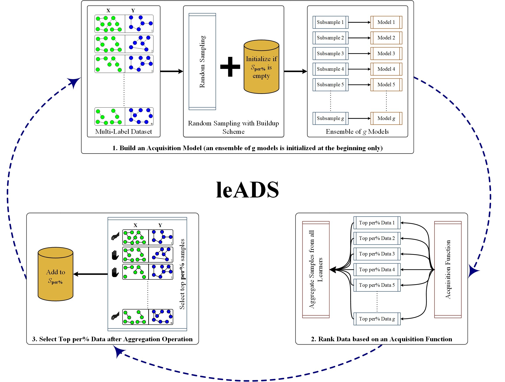

## Basic Description

This repo contains an implementation of leADS (mu**l**ti-label l**e**arning based on **A**ctive **D**ataset **S**
ubsampling) that leverages the idea of subsampling examples from data to reduce the negative impact of training loss.
Specifically, leADS performs an iterative procedure to: (a)- constructing an acquisition model in an ensemble
framework; (b) subselect informative examples using an acquisition function (entropy, mutual information, variation
ratios, normalized propensity scored precision at k); and (c)- train on reduced selected examples. The ensemble approach
was sought to enhance the generalization ability of the multi-label learning systems by concurrently building and
executing a group of multi-label base learners, where each is assigned a portion of samples, to ensure proper learning
of class labels (e.g. pathways). leADS was evaluated on the pathway prediction task using 10 multi-organism pathway
datasets, where the experiments revealed that leADS achieved very compelling and competitive performances against the
state-of-the-art pathway inference algorithms.

See tutorials on the [GitHub wiki](https://github.com/hallamlab/leADS/wiki) page for more informations and guidelines.

## Citing

If you find *leADS* useful in your research, please consider citing the following paper:

- M. A. Basher, Abdur Rahman and Hallam, Steven
  J.. **["Multi-label pathway prediction based on active dataset subsampling."](https://www.biorxiv.org/content/10.1101/2020.09.14.297424v1)**
  , bioRxiv (2020).

## Contact

For any inquiries, please contact: [arbasher@student.ubc.ca](mailto:arbasher@student.ubc.ca)
